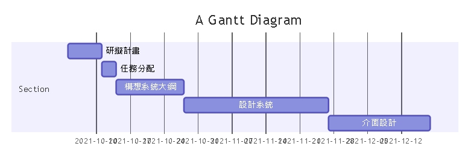
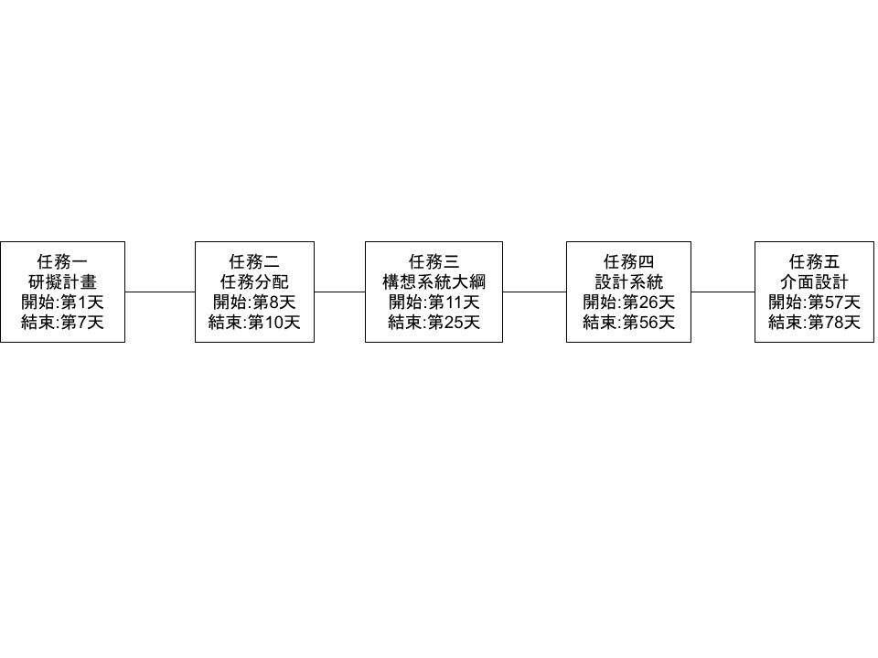
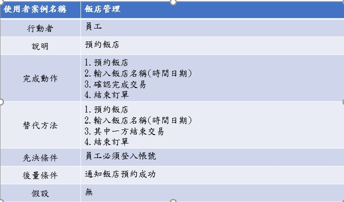
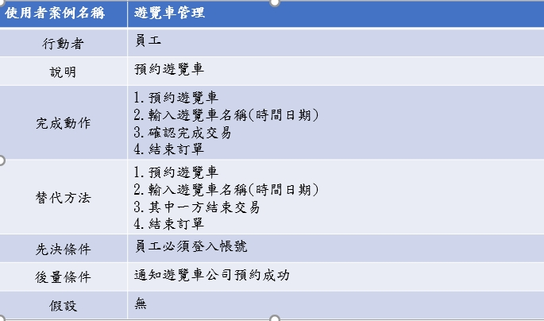
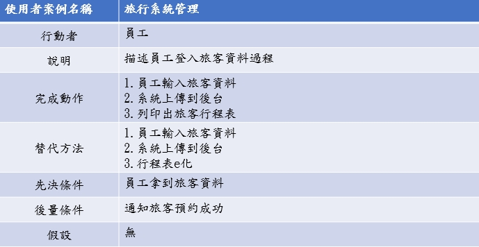

# 題目:旅行社預約系統
## 動機:現在的科技時代，多數人過於仰賴手機，長期坐著，身體不但會出問題還會增加眼睛負擔，該適時地出門踏青。旅行社用心安排獨特的行程，社內導遊專業且熱誠的服務，會吸引旅客前來報團，旅客只需在網上找到我們的旅行社，在線上預約系統，登記個人資料及想報名的旅行團，即可加入我們的旅行團。

#### 組長： C108118146 黎安綺 - 研擬計畫
#### 組員： 
#### C108118123 梁依玲-構想系統大綱
#### C108118115 陳品蓉-設計系統
#### C108118126 魏冠宇-介面設計
#### C107118283 鄭勛文-上台報告

### 功能需求: 1.人力資源管理 2.行程管理 3.財務與會計
### 非功能需求: 1.維護性 2.反應時間 3.使用性

#### 需求分析
#### 1.使用者(員工)可以藉由系統來做登入顧客資料。
#### 2.使用者可以藉由系統管理內部員工資訊。
#### 3.使用者可以確認遊覽車，飯店，遊客名單。
#### 4.使用者可清楚內部的財務狀況。

