# 題目:旅行社預約系統
## 動機:現在的科技時代，多數人走路玩手機，吃飯玩手機，放假在家也要宅在家玩手機，長期坐著不動，身體會出問題，嚴重增加眼睛的負擔。因此，應該適時地出門踏踏青。男女老少都適合出門踏青跟大自然接觸，吸收陽光養分，放下手機不再科技冷漠，增加人與人之間的互動，不只是能運動到身體，心靈上也能得到放鬆。遊山玩水是老少咸宜的活動，希望能讓愈來愈多人喜愛旅行，培養一個健康的興趣! 旅行社用心安排獨特的行程，社內導遊專業且熱誠的服務，會吸引旅客前來報團，旅客只需在網上找到我們的旅行社，在線上預約系統，登記個人資料及想報名的旅行團，即可加入我們的旅行團，飯店、餐廳、行程都會安排妥當，旅客只需等待旅行日期到來。

#### 組長： C108118146 黎安綺 - 研擬計畫
#### 組員： 
#### C108118123 梁依玲-研發程式
#### C108118115 陳品蓉-任務分配
#### C108118126 魏冠宇-系統測試
#### C107118283 鄭勛文-系統訓練

### 功能需求: 1.人力資源管理 2.行程管理 3.財務與會計
### 非功能需求: 1.維護性 2.反應時間 3.使用性

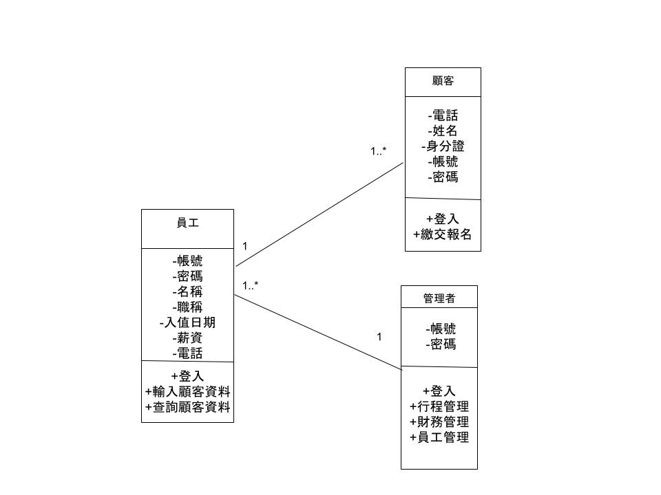
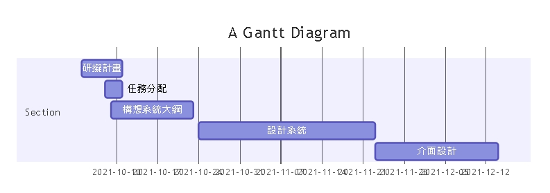
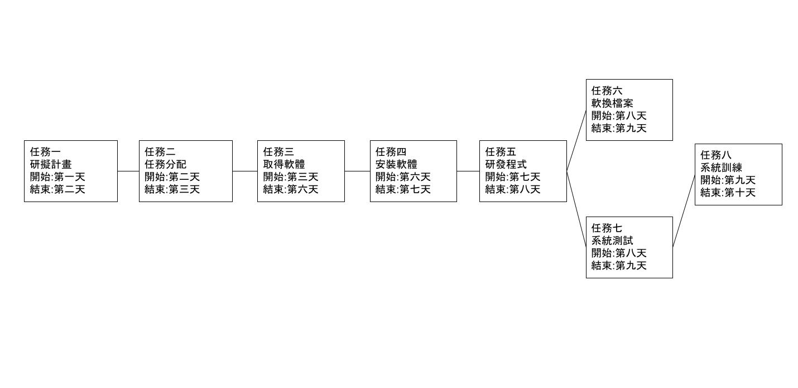
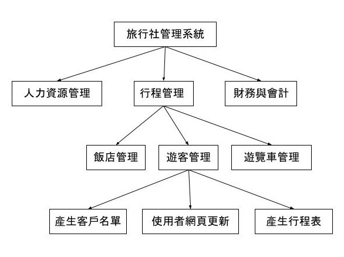
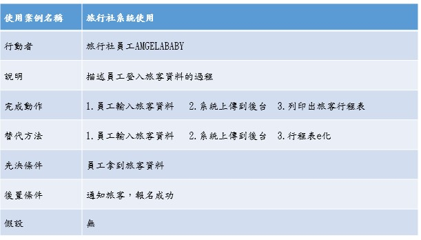
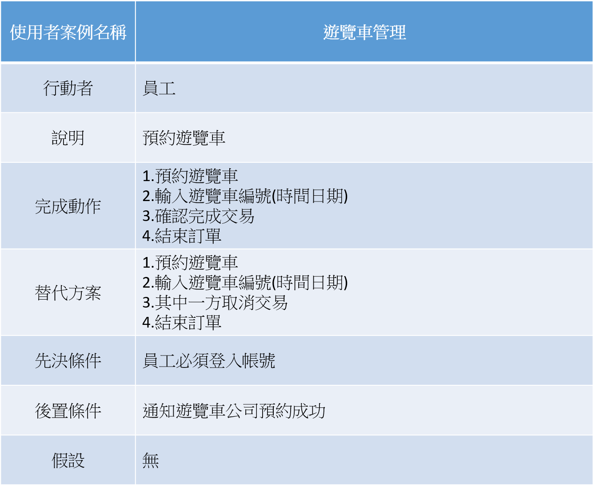
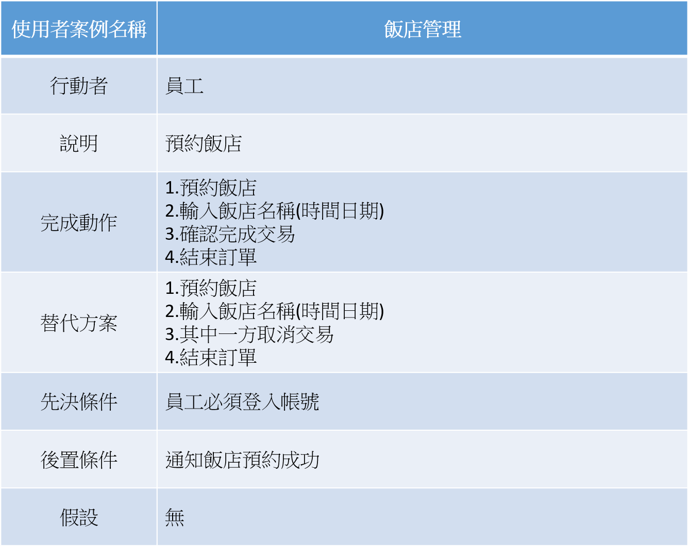
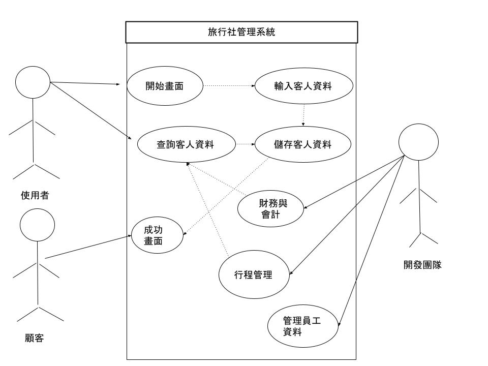

#### 需求分析
#### 1.使用者(員工)可以藉由系統來做登入顧客資料。
#### 2.使用者可以藉由系統管理內部員工資訊。
#### 3.使用者可以確認遊覽車，飯店，遊客名單。
#### 4.使用者可清楚內部的財務狀況。

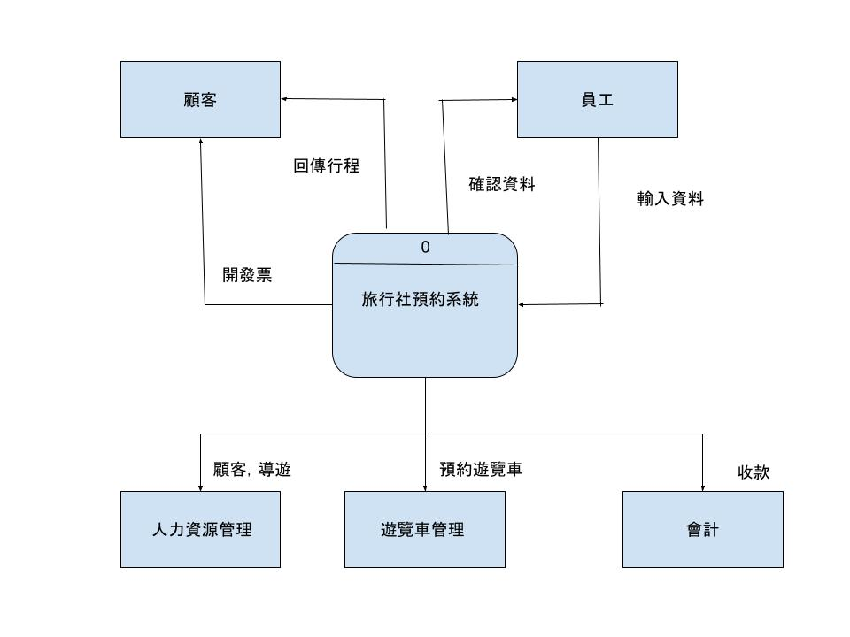
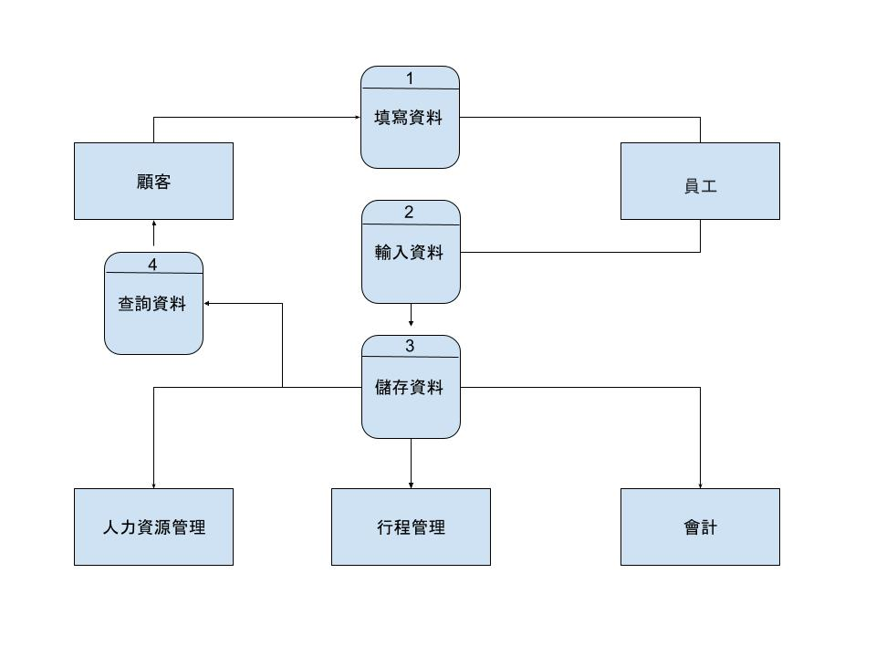
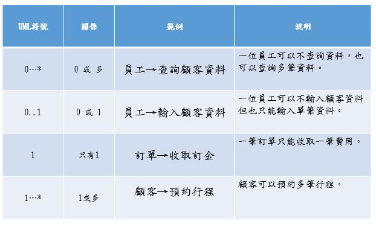

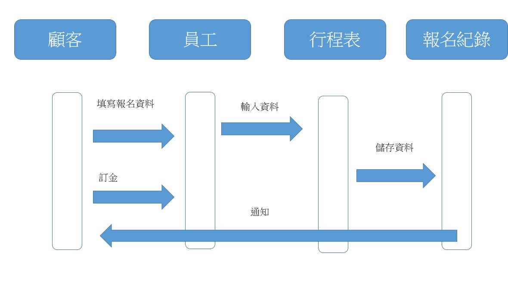
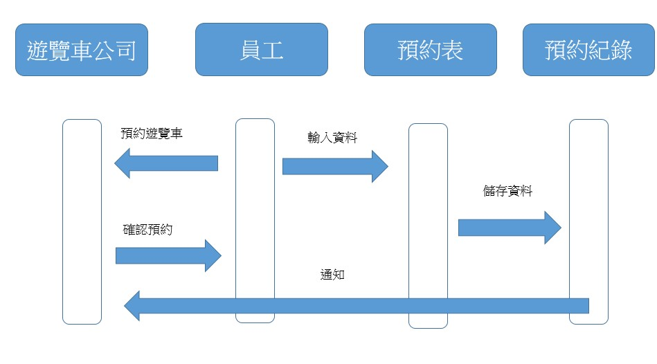
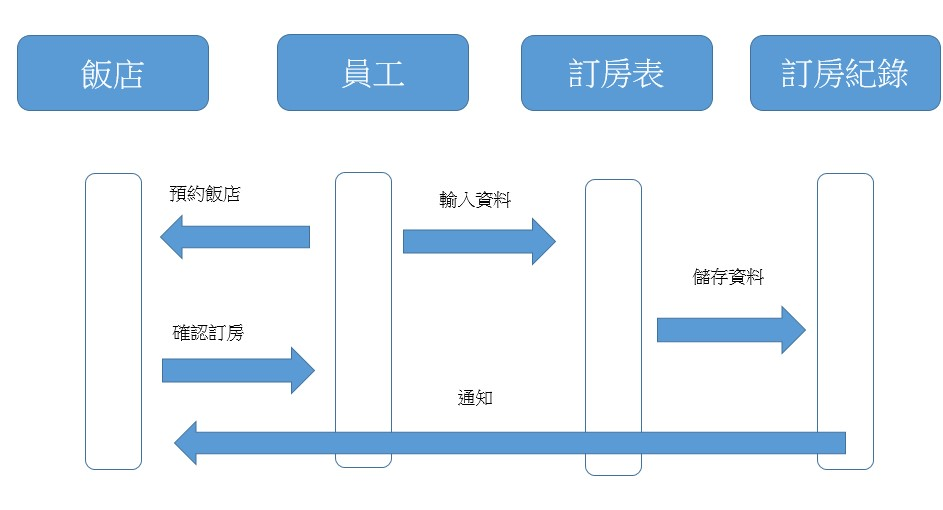

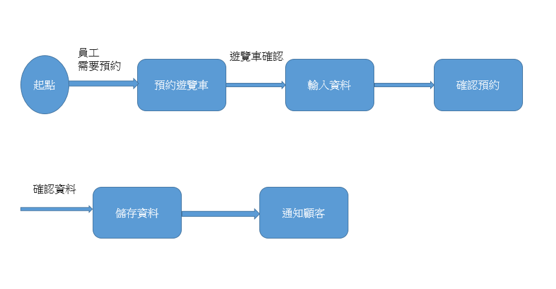
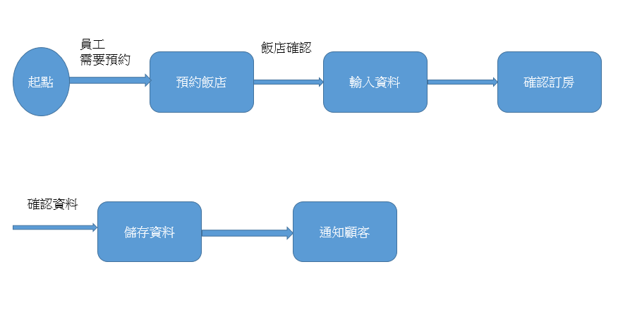
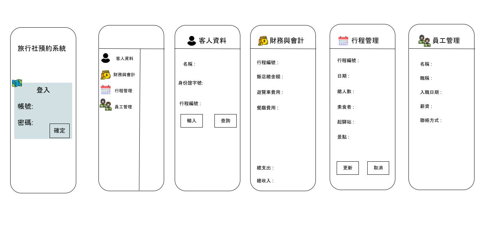
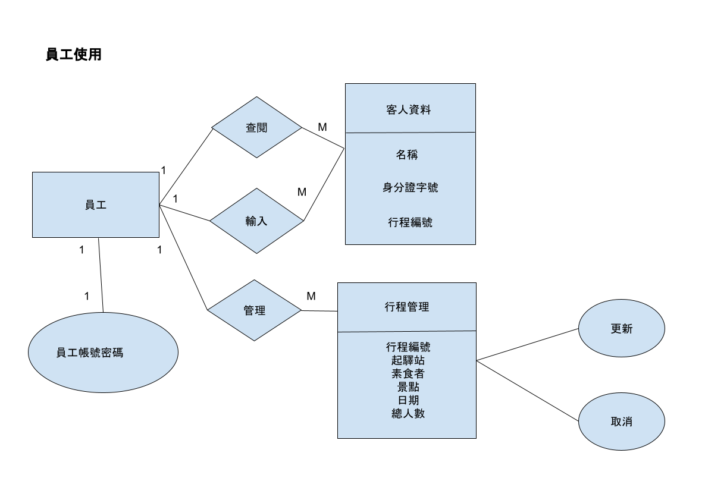
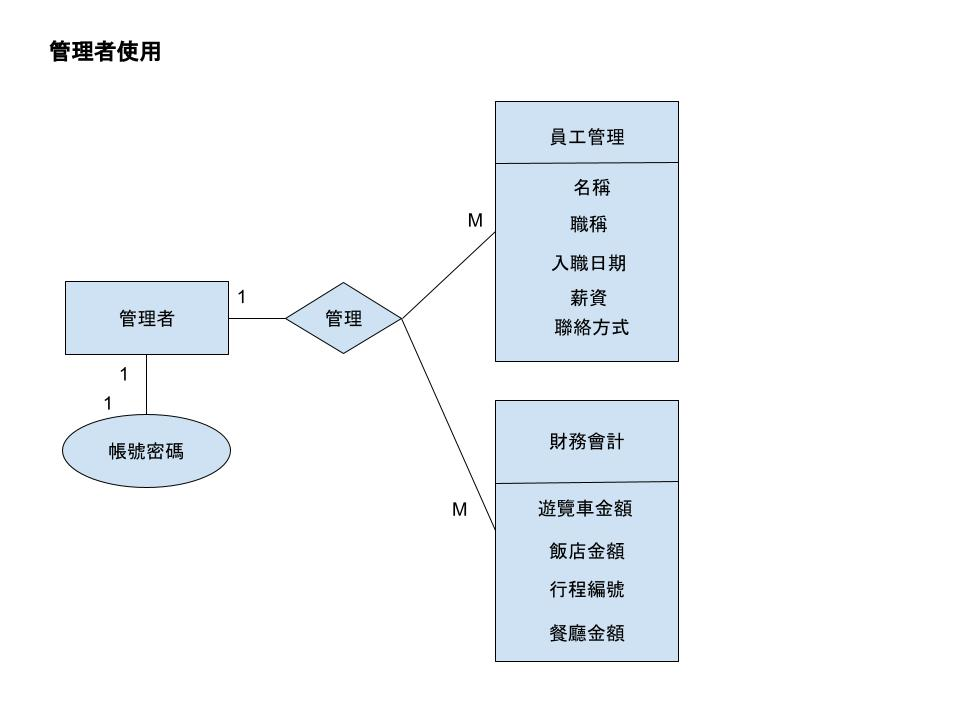
